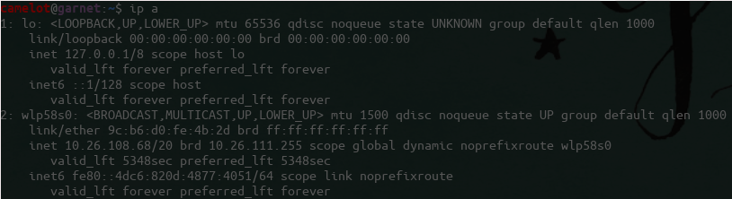

<p align="center"> Cami Carballo | Catalina Vajiac | Samantha Corn </p>

Client-server application suite for playing and sharing music.

TODO: pictures

# Motivation

Friends tend to study and do homework together often.  Lots of times we find ourselves sitting side 
by side, with our headphones on, sending each other links to songs we are currently jamming out to.
Occasionally, we find ourselves singing along to a song we are listening to and have everyone join
in. This prompts the immediate pausing of all other music and the unplugging of the headphones
currently transferring the signal of the current jam. How much easier would it be if we could all
just add our songs to a collective queue that would play each song choice from each person's queue
in a round robin fashion from one central set of speakers? 

Hence Jukestapose was born!

This project was originally created for a hackathon, and has remained mostly stagnant for the past
few years. We would like to improve upon it and make it more usable/fully featured.

# Installation

### Dependencies

* [Python] 3.X
* [Pip] 3.X
* [AVbin] 10

## From .tar.gz:

Download the current version of Jukestapose [here]!

```
tar xvzf Jukestapose-XXX.tar.gz -C Jukestapose
cd Jukestapose
sudo pip3 install -r REQUIREMENTS.txt
```

**XXX is the version of Jukestapose**

## From Source:

```
git clone https://github.com/camicarballo/Jukestapose.git
cd Jukestapose
sudo pip3 install -r REQUIREMENTS.txt
```

# Usage

So you've installed Jukestapose, gathered some friends, and are ready to start jamming?

## Setup

Start the server by opening a terminal and running `./start.sh`. You only need one person to do this, because sharing is caring and you're all going to be sharing this server (that's kinda the whole point). Note that restarting the server will wipe the play queue!

To connect to Jukestapose from individual devices, find the host IP address in the output of the server. For example:



For this server, the IP address you would use is `10.26.108.68`. 

Once you've located the IP address, just open up a browser, enter the IP address and port as your URL, and go!

TODO: Add image of running Jukestapose

Everyone that wants to listen or add to the play queue just has to access that addressinset.

## Adding songs to the queue

To add a song to the queue, click the button at the bottom of the Jukestapose site, and select an MP3 to add.

TODO: Picture of Jukestapose with circled button here

Aaaaaaand you're done! Your song has been added.

# Contributing

## Submitting Bugs

We are mere mortals, and thus the programs we produce may have some bugs in it. If while using Jukestapose, you come across unintended behaviors, please let us know!

[Submit a new issue] on the GitHub repository. Please make these issues as detailed as possible about what the bug is and what was happening with Jukestapose when it occurred. 

## Code Contributions

So you want to add to this project? Yay! 

# Future Improvements:
* Implement an algorithm for creating a fair queue of songs. Let's prevent the situation that one friend is spamming Jukestapose with thier choices and not allowing others' music be heard.
* Saving MP3s and indexing them. Currently, Jukestapose has users upload MP3 files everytime they are added. A future improvement is to have the server take MP3s for new songs, along with some data about them, and save them for future use without the MP3 upload. 
* Add a visible play queue that users can contribute to. Instead of relying soley on whatever songs get added, you could allow users to upvote or downvote upcoming songs in the queue, and majority opinion could determine play order. 

# Previous (OG) Contributors:
* Tim Burchfield
* Doug Smith
* Noah Yoshida

[Python]: 		        https://python.org
[Pip]:    		        https://pypi.org/project/pip/
[AVbin]:                https://avbin.github.io/AVbin/Download.html
[Submit a new issue]:	https://github.com/camicarballo/Jukestapose/issues/new
[here]:                 https://github.com/camicarballo/Jukestapose/releases
